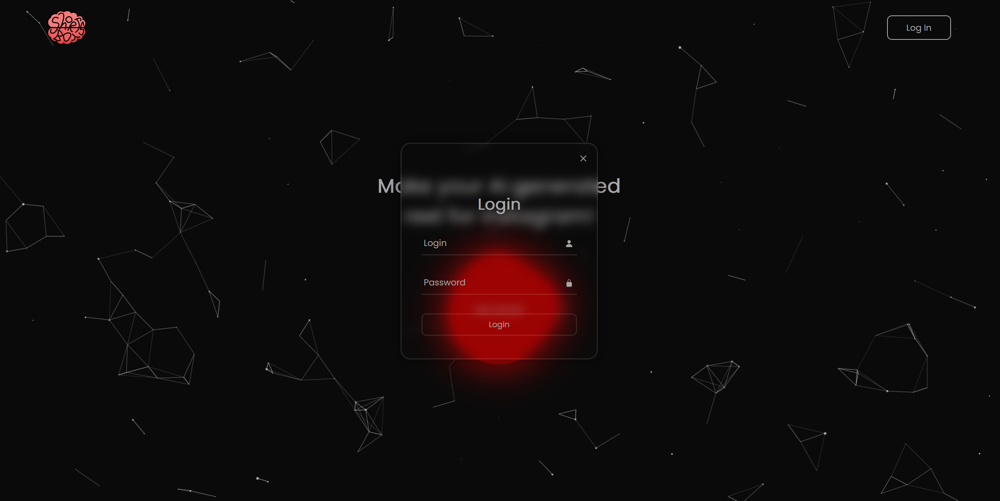
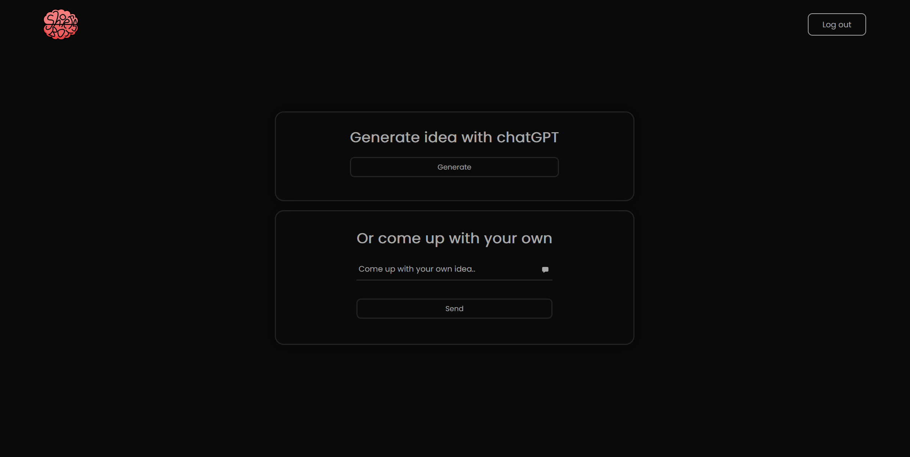
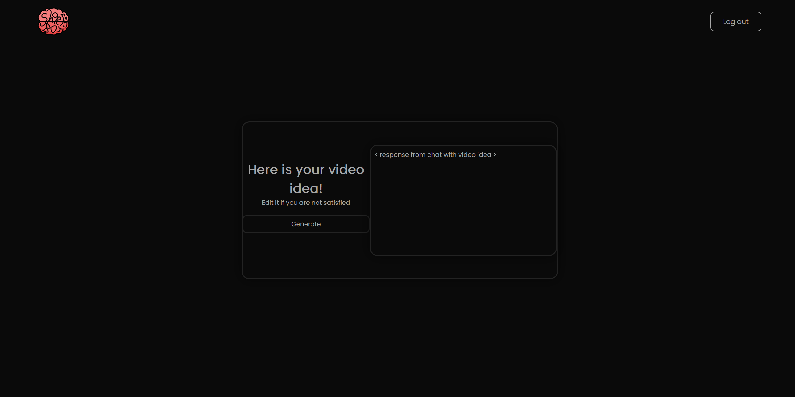

# Shorts BOT
## Project description
Node js app made as a college project for 'Software Engineering' subject.
Main purpose of the app is to autmate process of creating short videos for Instagram, commonly known as reels. Main goal was to create as intresting and creative videos, with AI voiceover and AI generated script, that user can effortlessly made many videos and upload them into the platform in a very simple way.
## App
### Home screen
Place where you can login into your existing account

### Log In popup

### Video idea generation
Choose between two options - get whole video idea from chatGPT or specify your choice by giving overall video description

### Video rendering based on description
If you are not satisfied with output, feel free to modify it to fullfill your expectations about outcoming video. Start generating video (this process can take a while ~5min)

### Generated video preview
When video is rendered it will automaticly show in the preview section with all of it's details such as vide URL, title and description with tags. Again if you are not satisfied there is an option to modify those text values. If everything is ok, press 'Upload' button to publish your video to your Instagram account.

## Instalation
To run this app you need to clone this repository than run command to install all dependencies:
> npm install

to run app:
>npm start

remember to setup propetly .env file with all important variables.

